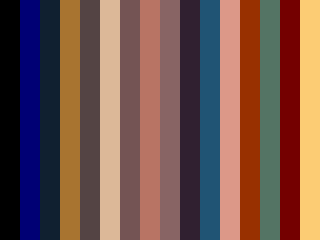
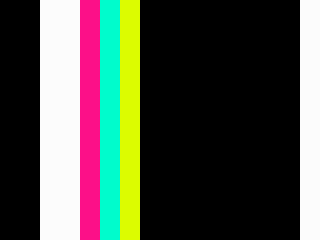

# Exploring Another World

In this repository, I explore how Eric Chahi's Another World is implemented.
Another World is a computer game released in 1991. It was initially written for
the Amiga 500, and then ported to other systems. A very interesting aspect of
the software is that it is mainly written as a virtual machine.

It all started the 2020-10-11 when I finally, after a long time, decided to
play again with graphics programming in Haskell. (This probably was itself
prompted by turning on my PlayStation 3, running Grid, whose first saved game
was from 2010). Then the night after, I had some trouble sleeping and started
to read about Another World. In particular, the Wikipedia page (at least the
one [in
French](https://fr.wikipedia.org/wiki/Another_World_(jeu_vid%C3%A9o)#Aspect_technique)
talks about a a game engine witten as a virtual machine running multiple light
threads. This got me curious and I wanted to read more. I started with the
resources linked below, then wrote some code to explore the game data.


## Resources

- [Eric Chahi's
  page](http://www.anotherworld.fr/anotherworld_uk/another_world.htm)
- [Code review by Fabien
  Sanglard](https://fabiensanglard.net/anotherWorld_code_review/)
- [Source code of the above
  review](https://github.com/fabiensanglard/Another-World-Bytecode-Interpreter)
- ["The polygons of"
  series](https://fabiensanglard.net/another_world_polygons/)
- [Gregory Montoir's raw(gl)](https://github.com/cyxx)

It seems the data of the PC version can be downloaded
[here](https://www.abandonware-france.org/ltf_abandon/ltf_jeu.php?id=68).

One of the most interesting resources is actually a commentary within the [main
file](https://github.com/fabiensanglard/Another-World-Bytecode-Interpreter/blob/8afc0f7d7d47f7700ad2e7d1cad33200ad29b17f/src/main.cpp)
in the above repository.

Some code is more readable in the original repository than in Fabien's. For
instance the code to decompress resources:
[Fabien's](https://github.com/fabiensanglard/Another-World-Bytecode-Interpreter/blob/master/src/bank.cpp)
v. [Gregory's](https://github.com/cyxx/rawgl/blob/master/unpack.cpp)

The commit comment in Gregrory's seems to say the unpacking code is similar to
this one: https://git.gatekiller.co.uk/games/flashback.
[Indeed](https://git.gatekiller.co.uk/games/flashback/src/branch/master/unpack.cpp).


## Current state

I have a small Haskell script that reads the `MEMLIST.BIN` files:

```
$ make && bin/exploring
[1 of 1] Compiling Main             ( bin/exploring.hs, bin/exploring.o )
Linking bin/exploring ...
Exploring Another World...
Reading entries from MEMLIST.BIN...
Read 147 entries.
All but the last entry have a NotNeeded state: True
The last entry has a LastEntry state: True
```

Note: the above code review talks about 146 "resources" and 148 "bank files".
I guess the second number is a mistake...

I also can generate some SQL `INSERT`s to represent the content of
`MEMLIST.BIN` file as a SQLite database.

```
$ make exploring.db && sqlite3 exploring.db \
    'SELECT sum(size) FROM memlist WHERE type != "LastEntry"'
1730258
```

Having such a relational database to query is really a nice way to explore the
data, as can be seen in some notes below.


## Notes

There are 13 `BANK` files, from `BANK01` to `BANK0D`. Bank IDs in `MEMLIST.BIN`
are numeric, thus ranging from 1 to 13. A given bank can contain multiple
resource types. For instance the bank 9 contains resource types `Palette`,
`ByteCode`, and `Cinematic`:

```
$ sqlite3 exploring.db 'SELECT type FROM memlist WHERE bank_id=9'
Palette
ByteCode
Cinematic
```

The first resouce in each bank starts at offset 0. There are an "empty"
resource (its size is zero), and a non-empty one at offset 0 in bank 1.

There a multiple resources whose size are zero; three of them have the same
bank ID and offset: 8 and 115980.

The following numbers match the code review linked above:

```
$ sqlite3 -init sqliterc.txt exploring.db \
    'select type, count(type) as total from memlist
     group by type order by total desc'
-- Loading resources from sqliterc.txt
type        total
----------  ----------
Sound       103
PolyAnim    12
Palette     9
Cinematic   9
ByteCode    9
Music       3
Unknown     1
LastEntry   1
```

And also match the reported (packed) size here in the [source
code](https://github.com/fabiensanglard/Another-World-Bytecode-Interpreter/blob/8afc0f7d7d47f7700ad2e7d1cad33200ad29b17f/src/main.cpp#L201-L208).

When reading a resource out of a bank, the last 32 bits indicate the size of
the unpacked data (and thus should match what is found in `MEMLIST.BIN`). For
instance, the very first palette can be extracted (but not unpacked yet) with:

```
$ scripts/build.sh && bin/exploring read-bank 1 95176 836 > palette-1
$ xxd palette-1 | tail -n 1
00000340: 0000 0800
```

We see that `8 * 256 = 2048`, wich is indeed the unpacked size of any palette.


### Palettes

All resources of type `Palette` have an uncompressed size of 2048 (and their
sizes within the `BANK` files are smaller, so the palettes are all compressed).

```
$ sqlite3 -init sqliterc.txt exploring.db \
    'select bank_id,bank_offset,size,packed_size from memlist
     where type="Palette" order by bank_id, bank_offset'
-- Loading resources from sqliterc.txt
bank_id     bank_offset  size        packed_size
----------  -----------  ----------  -----------
1           95176        2048        836
1           102512       2048        1336
3           0            2048        1196
9           0            2048        1268
10          0            2048        1260
10          30140        2048        1312
11          0            2048        1220
13          0            2048        1228
13          60108        2048        1376
```

The comment in the [source
code](https://github.com/fabiensanglard/Another-World-Bytecode-Interpreter/blob/master/src/resource.h#L74)
says the 2048 bytes are used for a VGA palette, and an EGA palette, each 1024
bytes.

In the game, each pixel color is given by a 4-bit index into the palette (so 1
byte is enough to describe two pixels.

Within the pallete, a color is specified using 5 bits for red, 6 bits for
green, and 5 bits for blue, i.e. a 565 format, and thus takes 2 bytes.

Given 2 bytes per color, and 16 colors, a palette is only 32 bytes. This seems
to mean there is actually 32 palettes in a Palette resource.

It is possible to convert the nth palette from BANK01 with the following calls.
They expect the `unpacked.bin` files produced in the section below.
(`palette-0` is all black.)

```
$ scripts/build.sh && bin/exploring write-palette 1
$ feh images/palette-01.png
```




I was unsure if the code to read the palette was correct, but the second image
above seems to match the colors seen in the title screens at the start of game.

Only the two images above are committed in this repository. If you want to generate
some other images:

```
$ for i in `seq 1 32` ; do runghc bin/exploring.hs write-palette $i ; done
$ feh -Zr. images/
```

## Unpack

While trying to understand `Bank::unpack` in Fabien's repository, I found that
Gregory's version in rawgl is easier to read. I looked at the code several
times on the span of three or four days. Interestingly, my understanding of it
increased each time in the first few minutes at staring at the code (as opposed
to the long minutes afterwards).

Anyway, I also found an interesting commit message in rawgl, mentionning
"ByteKiller". I first thought it was another version of similar code but it
seems it is the name of the compression software: as it was mentioned nowhere
else, this is an interesting find!

I have made a copy of rawgl's `unpack.cpp` in `unpack/` in this repository.
After adding the `READ_BE_UINT32` macro and the `warning` function, the file
compiles fine with `g++ -c unpack.cpp`. Then I added a `main` function to read
a resource from a `BANK` file:

```
$ ls unpack
unpack.cpp
$ g++ -o unpack/unpack unpack/unpack.cpp
$ ./unpack
$ ls -l unpacked
-rw-r--r-- 1 thu users  2048 Oct 17 14:45 unpacked.bin
```


## Parts

In both
[Fabien's](https://github.com/fabiensanglard/Another-World-Bytecode-Interpreter/blob/6093bbca11b046a64557354eb4c237b0318f4ec7/src/parts.cpp)
and
[Gregory's](https://github.com/cyxx/rawgl/blob/8b4c255453229bca15df715961554f85adec8eb5/resource.cpp#L566-L577)
versions, the list of game "parts" are hard-coded, and for each part, the
palette, virtual machine instructions, and graphics (both cinematics and
gameplay) IDs (i.e. indices into `MEMLIST.BIN`) are known.
